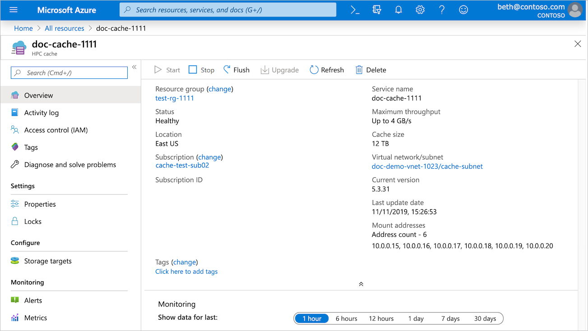

# Create an Azure HPC Cache

Use the Azure portal to create your cache.

## Define basic details

In **Project Details**, select the subscription and resource group that will host the cache. Make sure the subscription is on the [access](hpc-cache-prereqs.md#azure-subscription) list.

In **Service Details**, set the cache name and these other attributes:

* Location - Select one of the [supported regions](hpc-cache-overview.md#region-availability).
* Virtual network - You can select an existing one or create a new virtual network.
* Subnet - Choose or create a subnet with at least 64 IP addresses (/24) that will be used only for this Azure HPC Cache instance.

## Set cache capacity
<!-- referenced from GUI - update aka.ms link if you change this header text -->

On the **Cache** page, you must set the capacity of your cache. The values set here determine how much data your cache can hold and how quickly it can service client requests.

Capacity also affects the cache's cost.

Choose the capacity by setting these two values:

* The maximum data transfer rate for the cache (throughput), in GB/second
* The amount of storage allocated for cached data, in TB

Choose one of the available throughput values and cache storage sizes.

Keep in mind that the actual data transfer rate depends on workload, network speeds, and the type of storage targets. The values you choose set the maximum throughput for the entire cache system, but some of that is used for overhead tasks. For example, if a client requests a file that isn't already stored in the cache, or if the file is marked as stale, your cache uses some of its throughput to fetch it from backend storage.

Azure HPC Cache manages which files are cached and preloaded to maximize cache hit rates. The cache contents are continuously assessed and files are moved to long-term storage when they are less frequently accessed. Choose a cache storage size that can comfortably hold the active set of working files with additional space for metadata and other overhead.

## Enable Azure Key Vault encryption (optional)

If your cache is in a region that supports customer-managed encryption keys, the **Disk encryption keys** page appears between the **Cache** and **Tags** tabs. As of publication time, this option is supported in East US, South Central US, and West US 2.

If you want to manage the encryption keys used with your cache storage, supply your Azure Key Vault information on the **Disk encryption keys** page. The key vault must be in the same region and in the same subscription as the cache.

You can skip this section if you do not need customer-managed keys. Azure encrypts data with Microsoft-managed keys by default. Read [Azure storage encryption](../storage/common/storage-service-encryption.md) to learn more.

> [!NOTE]
>
> * You cannot change between Microsoft-managed keys and customer-managed keys after creating the cache.
> * After the cache is created, you must authorize it to access the key vault. Click the **Enable encryption** button in the cache's **Overview** page to turn on encryption. Take this step within 90 minutes of creating the cache.
> * Cache disks are created after this authorization. This means that the initial cache creation time is short, but the cache will not be ready to use for ten minutes or more after you authorize access.

For a complete explanation of the customer-managed key encryption process, read [Use customer-managed encryption keys for Azure HPC Cache](customer-keys.md).

Select **Customer managed** to choose customer-managed key encryption. The key vault specification fields appear.<!-- double check --> Select the Azure Key Vault to use, then select the key and version to use for this cache. The key must be a 2048-bit RSA key. You can create a new key vault, key, or version from this page.
<!-- + screenshot of key create/select page -->

After you create the cache, you must authorize it to use the key vault service. Read [Authorize Azure Key Vault encryption from the cache](customer-keys.md#3-authorize-azure-key-vault-encryption-from-the-cache) for details.

## Add resource tags (optional)

The **Tags** page lets you add [resource tags](https://go.microsoft.com/fwlink/?linkid=873112) to your Azure HPC Cache instance.

## Finish creating the cache

After configuring the new cache, click the **Review + create** tab. The portal validates your selections and lets you review your choices. If everything is correct, click **Create**.

Cache creation takes about 10 minutes. You can track the progress in the Azure portal's notifications panel.

When creation finishes, a notification appears with a link to the new Azure HPC Cache instance, and the cache appears in your subscription's **Resources** list.
<!-- double check on notification -->

## Next steps

After your cache appears in the **Resources** list, you can move to the next step.

* [Define storage targets](hpc-cache-add-storage.md) to give your cache access to your data sources.
* If you use customer-managed encryption keys, you need to [authorize Azure Key Vault encryption](customer-keys.md#3-authorize-azure-key-vault-encryption-from-the-cache) from the cache's overview page to complete your cache setup. You must do this step before you can add storage. Read [Use customer-managed encryption keys](customer-keys.md) for details.
