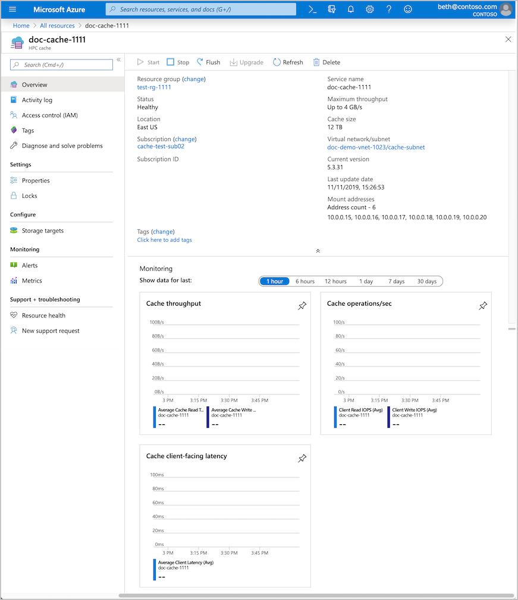

# Manage your cache from the Azure portal

The cache overview page in the Azure portal shows project details, cache status, and basic statistics for your cache. It also has controls for deleting the cache, flushing data to long-term storage, or updating software.

To open the overview page, select your cache resource in the Azure portal. For example, load the **All resources** page and click the cache name.

 <!-- placeholder is identical to hpc-cache-new-overview.png; replace with better image (showing graphs, full sidebar) when available -->

The buttons at the top of the page can help you manage the cache:

* [**Flush**](#flush-cached-data) - Writes all cached data to storage targets
* [**Upgrade**](#upgrade-cache-software) - Updates the cache software
* **Refresh** - Reloads the overview page
* [**Delete**](#delete-the-cache) - Permanently destroys the cache

Read more about these options below.

## Flush cached data

The **Flush** button on the overview page tells the cache to immediately write all changed data that is stored in the cache to the back-end storage targets. The cache routinely saves data to the storage targets, so it's not necessary to do this manually unless you want to make sure the back-end storage system is up to date. For example, you might use **Flush** before taking a storage snapshot or checking the dataset size.

> [!NOTE]
> During the flush process, the cache can't serve client requests. Access is suspended until the flush operation finishes.

When you start the cache flush operation, the cache stops accepting client requests, and the cache status on the overview page changes to **Flushing**.

Data in the cache is saved to the appropriate storage targets. The process can take a few minutes or it can take an hour or more depending on how much data has been written to the cache recently.

After all the data is saved to storage targets, the cache automatically starts taking client requests again. The cache status returns to **Healthy**.

## Upgrade cache software

If a new software version is available, the **Upgrade** button becomes active. You also might see a message at the top of the page about updating software.

Client access is not interrupted during a software upgrade, but cache performance is slower than usual. Plan to upgrade software during non-peak usage hours or in a planned maintenance period. The software update can take several hours. Caches configured with higher throughput take longer to upgrade than caches with smaller peak throughput values.

If you do not upgrade software within the specified time period, Azure will automatically apply the update for you. The timing of the automatic upgrade is not configurable. If you are concerned about impacting cache performance, you should update the software yourself before the time period expires.

When you click the **Upgrade** button, the upgrade begins right away. The cache status changes to **Upgrading** until the operation completes.

## Delete the cache

The delete button destroys the cache. When you delete a cache, the compute resources are destroyed and no longer incur account charges.

Storage targets are unaffected when you delete the cache. You can add them to a future cache later, or decommission them separately.

The cache automatically flushes any unsaved data to storage targets as part of its final shut down.

## Cache metrics and monitoring

The overview page shows graphs for some basic cache statistics - cache throughput, operations per second, and request latency.

These charts are part of Azure's built-in monitoring and analytics tools. Additional tools and alerts are available from the pages under the **Monitoring** heading in the portal sidebar. Learn more in the portal section of the [Azure Monitoring documentation](../azure-monitor/insights/monitor-azure-resource#monitoring-in-the-azure-portal).

## Next steps

<!-- * Learn more about metrics and statistics for hpc cache -->
* Learn more about [Azure metrics and statistics tools](../azure-monitor/)
* Get [help with your Azure HPC Cache](hpc-cache-support-ticket.md)
